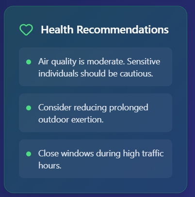

# 🌍 Duniya Mausam - Climate Intelligence Hub

> *"Climate crisis at its peak — while world leaders sleep, ignoring the very disaster they helped create."*

[](https://opensource.org/licenses/MIT)
[](https://www.python.org/downloads/)
[](https://reactjs.org/)
[](https://flask.palletsprojects.com/)

## 🌟 What is Duniya Mausam?

Duniya Mausam (meaning "World Weather") is a **real-time climate intelligence platform** that empowers individuals and communities to make informed decisions about their health and environment. In a world where climate change affects our daily lives, this tool provides critical environmental data with actionable health recommendations.

### 🎯 Why We Built This

- **Climate Crisis Awareness**: Every day, millions of people are exposed to harmful air quality without knowing it
- **Health Protection**: Understanding environmental conditions helps protect vulnerable populations
- **Data Accessibility**: Making complex environmental data simple and actionable
- **Community Empowerment**: Giving people the tools to protect their families and communities

## ✨ Features

### 🌡️ Real-Time Environmental Monitoring
- **Air Quality Index (AQI)** with US EPA standards
- **Weather Conditions** including temperature, humidity, wind speed
- **Pollutant Analysis** (PM2.5, PM10, NO₂, O₃, SO₂, CO)
- **Location-Based Data** for any city worldwide

### 🏥 Health Intelligence
- **Personalized Health Recommendations** based on current AQI
- **Risk Categories** with clear, color-coded warnings
- **Vulnerable Group Alerts** for children, elderly, and sensitive individuals
- **Activity Suggestions** (when to exercise outdoors, mask recommendations)

### 📊 Smart Analytics
- **Interactive Pollutant Cards** with detailed breakdowns
- **Trend Visualization** with progress bars and charts
- **Data Export** capabilities for personal tracking
- **Share Reports** with family and friends

## 🚀 Getting Started

### Prerequisites

Before you begin, ensure you have the following installed:
- **Python 3.8+** ([Download](https://www.python.org/downloads/))
- **Node.js 16+** ([Download](https://nodejs.org/))
- **Git** ([Download](https://git-scm.com/))

### 🔑 API Keys Required

You'll need free API keys from:
1. **OpenWeatherMap** - [Get API Key](https://openweathermap.org/api)
2. **World Air Quality Index (WAQI)** - [Get Token](https://aqicn.org/api/)

### 📦 Installation

1. **Clone the Repository**
   ```bash
   git clone https://github.com/Yash2204V/duniya-mausam.git
   cd duniya-mausam
   ```

2. **Set Up Backend**
   ```bash
   cd backend
   
   # Create virtual environment
   python -m venv venv
   
   # Activate virtual environment
   # On Windows:
   venv\Scripts\activate
   # On macOS/Linux:
   source venv/bin/activate
   
   # Install dependencies
   pip install -r requirements.txt
   
   # Create environment file
   cp .env.example .env
   # Edit .env with your API keys
   ```

3. **Set Up Frontend**
   ```bash
   cd ../frontend
   
   # Install dependencies
   npm install
   
   # Create environment file
   cp .env.example .env
   # Edit .env if needed
   ```

4. **Configure Environment Variables**
   
   **Backend (.env):**
   ```env
   OPENWEATHER_API_KEY=your_openweather_api_key_here
   WAQI_API_TOKEN=your_waqi_token_here
   FLASK_ENV=development
   ```

   **Frontend (.env):**
   ```env
   VITE_BACKEND_URL=http://127.0.0.1:5000
   ```

### 🏃‍♂️ Running the Application

1. **Start Backend Server**
   ```bash
   cd backend
   python app.py
   ```
   Server runs on: `http://127.0.0.1:5000`

2. **Start Frontend Development Server**
   ```bash
   cd frontend
   npm run dev
   ```
   Application runs on: `http://localhost:5173`

## 🛠️ Tech Stack

### Backend
- **Flask** - Lightweight Python web framework
- **Flask-CORS** - Cross-origin resource sharing
- **Requests** - HTTP library for API calls
- **Python-dotenv** - Environment variable management

### Frontend
- **React 18** - Modern UI library
- **Vite** - Lightning-fast build tool
- **Tailwind CSS** - Utility-first styling
- **Framer Motion** - Smooth animations
- **Lucide React** - Beautiful icons
- **Axios** - HTTP client for API calls

### APIs
- **OpenWeatherMap API** - Weather data
- **World Air Quality Index API** - Air pollution data

## 📚 API Documentation

### Get Environmental Data
```http
GET /environment?city={city_name}
```

**Response:**
```json
{
  "city": "Delhi",
  "weather_data": {
    "temperature": 28.5,
    "humidity": 65,
    "weather": "haze"
  },
  "aqi_data": {
    "aqi_us": 152,
    "dominant_pollutant": "pm25",
    "pollutants": {
      "pm25": 89.2,
      "pm10": 156.7,
      "o3": 42.1,
      "no2": 28.3
    }
  }
}
```

## 🎨 Screenshots

### Main Dashboard


### Health Recommendations


### Pollutant Analysis


## Guide


## 🤝 Contributing

We believe in the power of community! Here's how you can contribute:

### 🐛 Bug Reports
Found a bug? Please create an issue with:
- Steps to reproduce
- Expected vs actual behavior
- Screenshots if applicable
- Your environment details

### 💡 Feature Requests
Have an idea? We'd love to hear it! Create an issue describing:
- The problem you're trying to solve
- Your proposed solution
- Why it would benefit users

### 🔧 Code Contributions
1. Fork the repository
2. Create a feature branch (`git checkout -b feature/amazing-feature`)
3. Commit your changes (`git commit -m 'Add amazing feature'`)
4. Push to branch (`git push origin feature/amazing-feature`)
5. Open a Pull Request

## 📄 License

This project is licensed under the MIT License - see the [LICENSE](LICENSE) file for details.

## 🙏 Acknowledgments

- **OpenWeatherMap** for providing weather data API
- **World Air Quality Index** for air pollution data
- **React Community** for the amazing ecosystem
- **Tailwind CSS** for the beautiful styling framework
- **Climate Scientists** worldwide for their invaluable research

## 📞 Support

- 🌐 Linkedin: https://www.linkedin.com/in/yash-varma-/
- 🐛 Issues: [GitHub Issues](https://github.com/Yash2204V/duniya-mausam/issues)
- 💬 Discussions: [GitHub Discussions](https://github.com/Yash2204V/duniya-mausam/discussions)

## 🌍 Our Mission

*In a world where climate change affects every breath we take, Duniya Mausam stands as a beacon of awareness and empowerment. We believe that access to environmental data isn't just a convenience—it's a fundamental right that enables people to protect their health and their families.*

*Together, we can build a more informed, healthier, and more resilient world.*

---

**Built with ❤️ for environmental awareness and community health**